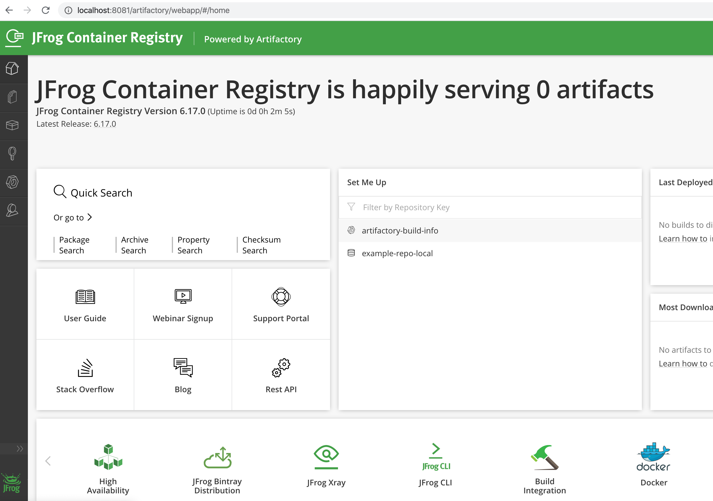

# Set up a Docker Registry with JFrog Artifactory 

1. Start an JCR(JFrog Container Registry) instance
 ``` 
 docker run --name artifactory \
 -d -p 8081:8081 \
 -v /Users/Shared/Artifactory:/var/opt/jfrog/artifactory \
 docker.bintray.io/jfrog/artifactory-jcr:latest
 
 ```

2. Log on to the registry console
Log on to the newly created registry   <http://localhost:8081> with the default credentials `admin/password`



3. Create a Repository 


4. Push an image 


5. Browse the persistent volume 