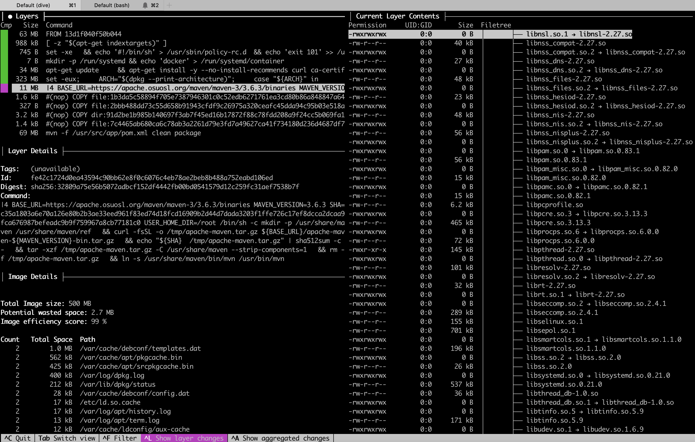

# Containerize a Maven Java Application 

1. Get the application sources

 ``` 
 git clone https://github.com/spring-guides/gs-rest-service.git
 ```
We will be using the `complete` version of the tutorial [Spring boot tutorial]
(https://spring.io/guides/gs/rest-service/)

2. Run the application locally
 ``` 
$ cd gs-rest-service/complete
$ mvn spring-boot:run
 ```
The application start and expose an http interface on port   <http://localhost:8080>


```
  .   ____          _            __ _ _
 /\\ / ___'_ __ _ _(_)_ __  __ _ \ \ \ \
( ( )\___ | '_ | '_| | '_ \/ _` | \ \ \ \
 \\/  ___)| |_)| | | | | || (_| |  ) ) ) )
  '  |____| .__|_| |_|_| |_\__, | / / / /
 =========|_|==============|___/=/_/_/_/
 :: Spring Boot ::        (v2.2.2.RELEASE)

2020-02-24 15:13:44.742  INFO 14374 --- [           main] c.e.restservice.RestServiceApplication   : Starting RestServiceApplication on EW-MBPt15-2018 
2020-02-24 15:13:46.046  INFO 14374 --- [           main] o.s.b.w.embedded.tomcat.TomcatWebServer  : Tomcat started on port(s): 8080 (http) with context path ''
2020-02-24 15:13:46.049  INFO 14374 --- [           main] c.e.restservice.RestServiceApplication   : Started RestServiceApplication in 1.715 seconds (JVM running for 2.186)
```

3. Send Sample requests

```
curl -i localhost:8080/greeting
HTTP/1.1 200
Content-Type: application/json
Transfer-Encoding: chunked
Date: Mon, 24 Feb 2020 14:32:03 GMT

{"id":3,"content":"Hello, World!"}


$ curl -i localhost:8080/greeting?name=Jeff
HTTP/1.1 200
Content-Type: application/json
Transfer-Encoding: chunked
Date: Mon, 24 Feb 2020 14:32:40 GMT

{"id":4,"content":"Hello, Jeff!"}
```


4. Containerize the current application  

* Create a Dockerfile  // Explore Docker file 
```
FROM maven:3-jdk-11-openj9
COPY ./gs-rest-service/complete/src  /usr/src/app/src
COPY ./gs-rest-service/complete/pom.xml /usr/src/app/pom.xml
EXPOSE 8080
RUN mvn -f /usr/src/app/pom.xml clean package
CMD java -jar /usr/src/app/target/rest-service-0.0.1-SNAPSHOT.jar
```

* Discuss the Dockerfile Content 

* Build the docker image 

```
docker build -t nelvadas/greeting:1.0.0 .
```

* Explore the image layers using dive 

```
dive nelvadas/greeting:1.0.0
```



* Run the application in a container environment 

```
docker run -d -p 8082:8080  --name greetingserver nelvadas/greeting:1.0.0 
```

Check the container list  with `docker ps` or `docker container ls `

```
$ docker container ls
CONTAINER ID        IMAGE                     COMMAND                  CREATED             STATUS              PORTS                    NAMES
b153de297fb4        nelvadas/greeting:1.0.0   "/usr/local/bin/mvn-…"   2 minutes ago       Up 2 minutes        0.0.0.0:8082->8080/tcp   greetingserver
```

* Resend the previous requests 

```
$ curl -i localhost:8082/greeting
HTTP/1.1 200
Content-Type: application/json
Transfer-Encoding: chunked
Date: Mon, 24 Feb 2020 14:59:28 GMT

{"id":1,"content":"Hello, World!"}


$ curl -i localhost:8082/greeting?name=MyContainer
HTTP/1.1 200
Content-Type: application/json
Transfer-Encoding: chunked
Date: Mon, 24 Feb 2020 15:00:22 GMT

{"id":2,"content":"Hello, MyContainer!"}

```

* Check the container logs 
```
$ docker logs b153de297fb4
...
2020-02-24 14:55:52.991  INFO 19 --- [           main] c.e.restservice.RestServiceApplication   : Started RestServiceApplication in 4.364 seconds (JVM running for 5.668)
2020-02-24 14:59:28.641  INFO 19 --- [nio-8080-exec-1] o.a.c.c.C.[Tomcat].[localhost].[/]       : Initializing Spring DispatcherServlet 'dispatcherServlet'
2020-02-24 14:59:28.641  INFO 19 --- [nio-8080-exec-1] o.s.web.servlet.DispatcherServlet        : Initializing Servlet 'dispatcherServlet'
2020-02-24 14:59:28.653  INFO 19 --- [nio-8080-exec-1] o.s.web.servlet.DispatcherServlet        : Completed initialization in 11 ms
EW-MBPt15-2018:docker-build elvadasnonowoguia$
```
