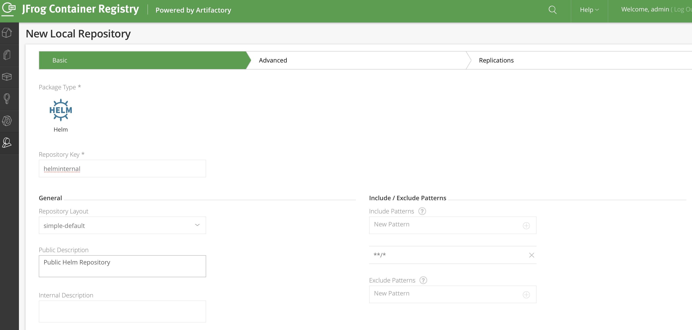
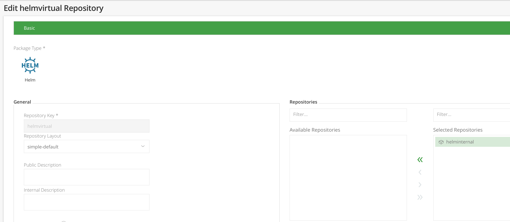

# Create Helm chart 

1. Instlall HELM 3
 
    Use te following command to install helm3 
    ```
    $ curl https://raw.githubusercontent.com/helm/helm/master/scripts/get-helm-3 | bash
    ```


2. Create a Helm repository on JFrog Artifactory

* Create a HELM Repository



* Create a virtual HELM Repository
Create the `helmvirtual` HELM Virtual repository and plug it in front of `helminternal` repository




3. Create the Chart 

* Ensure your are using Helm v3
```
$ helm version --short
v3.1.1+gafe7058
```
* Create a greeting chart 

```
$ helm create greeting
```

Test the chart installation with this command 
```
helm install --dry-run test greeting
```

Modifiy the template folder and Values files to deploy the greeting application.

* Export the deployement yaml file 
Exxport  YAML files from [lab5](./05-DeployToKubernetes.md)

```
kubectl get deploy/greeting -n greeting -o yaml > greeting/templates/deploy.yaml
```

Edit the deploy.yaml and include a template expression for labels and image tag


Export the original service 
```
kubectl get svc/greeting -n greeting -o yaml > greeting/templates/svc.yaml
```
Remove all k8s generated attributes from the exported YAML files like
- uuid
- creation timestamp
- status etc..

4. Customize YAML Templating 

* Customize Deployment and service 

Add a diffent template for image repository and tag.

```
containers:
      - image: "{{ .Values.image.repository }}:{{ .Values.image.tag }}"
        imagePullPolicy: {{ .Values.image.pullPolicy }}
```

In the service file, add a conditionnal Go template to generate the `ports[0].nodePort` value only if the service type is `NodePort`

```

apiVersion: v1
kind: Service
metadata:
  labels:
  name: {{ include "greeting.name" . }}
spec:
  externalTrafficPolicy: Cluster
  ports:
  - protocol: TCP
   {{- if contains "NodePort" .Values.service.type  }}
    nodePort: {{ .Values.service.nodePort }}
   {{- end }}
    port: {{ .Values.service.port }}
    targetPort: {{ .Values.service.targetPort }}
  selector:
    {{- include "greeting.selectorLabels" . | nindent 8 }}
  sessionAffinity: None
  type: {{ .Values.service.type }}
  ```


* Customize values files 
```
# This is a YAML-formatted file.
# Declare variables to be passed into your templates.

replicaCount: 2

image:
  repository: nelvadas/greeting
  pullPolicy: IfNotPresent
  tag: 2.0.0


service:
  nodePort: 30080
  targetPort: 8080
  port: 8000
  type: NodePort

ingress:
  enabled: false
```

5. Package the Chart

```
helm package ./greeting
Successfully packaged chart and saved it to: .../OpenSource/labs/greeting-0.1.0.tgz
```

The packaged chart is available here [ greeting-0.1.0.tgz](./greeting-0.1.0.tgz)

5. Push the chart into your Artifactory repository


6. Install the Application from Helm Repo in a demo namespace 


```
helm install  greeting0 ./greeting-0.1.0.tgz -n demo
```


Check the helm deployments
```
$ helm ls
NAME     	NAMESPACE	REVISION	UPDATED                             	STATUS  	CHART         	APP VERSION
greeting0	demo     	1       	2020-03-02 09:58:19.076183 +0100 CET	deployed	greeting-0.1.0	1.16.0
```

```
$ kubectl get pods -n demo
NAME                        READY   STATUS    RESTARTS   AGE
greeting-6c8f96f7f6-p7gnp   1/1     Running   0          16s
greeting-6c8f96f7f6-rnpz8   1/1     Running   0          16s
```


Test the application
```
$ curl localhost:30080/greeting
{"id":1,"content":"Hello, World!"}
```


7. Upgrade the application

Reduce the pods from 2 to only 1 replicas

```
helm upgrade greeting0 ./greeting-0.1.0.tgz  --set replicaCount=1
```

```
$ kubectl get pod
NAME                        READY   STATUS    RESTARTS   AGE
greeting-6c8f96f7f6-rnpz8   1/1     Running   0          4m24s
```
```
 kubectl get deploy
NAME       READY   UP-TO-DATE   AVAILABLE   AGE
greeting   1/1     1            1           4m49s
```
