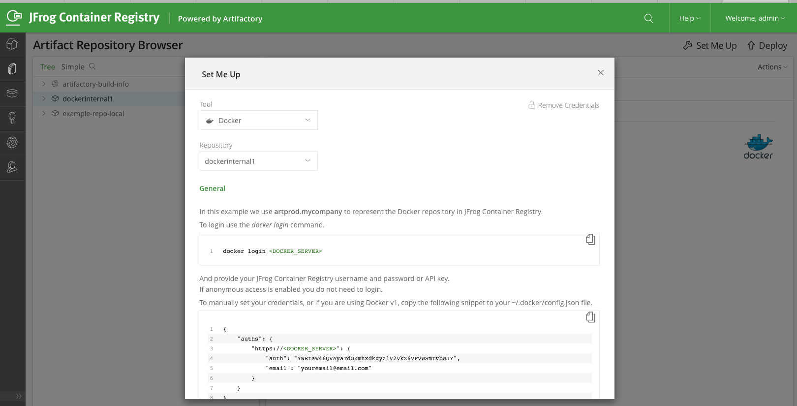
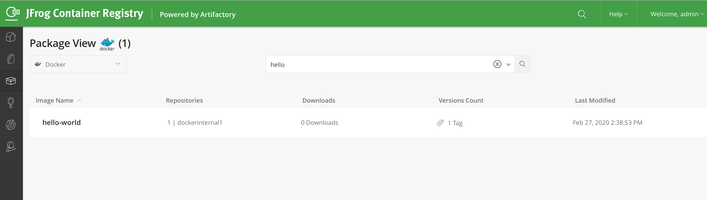

# Set up a Docker Gitlab instance 

1. Start an JCR(JFrog Container Registry) instance
 ``` 
 docker run --detach \
  --hostname gitlab.example.com \
  --publish 443:443 --publish 80:80 --publish 22:22 \
  --name gitlab \
  --restart always \
  --volume /Users/Shared/Gitlab/config:/etc/gitlab:Z \
  --volume /Users/Shared/Gitlab/logs:/var/log/gitlab:Z \
  --volume /Users/Shared/Gitlab/data:/var/opt/gitlab:Z \
  gitlab/gitlab-ce:latest
 
 ```

2. Log on to the registry console
Log on to the newly created registry   <http://localhost:8081> with the default credentials `admin/password`


3. Create a Repository 
* Create an internal docker repository using the `Admin>Repository>Local>New` Menu
* Select the package type `Docker`
* Save and Finish
* Follow the `Artifact Repository Browser` Menu, select your docker internal repository and then click the `Set Me Up` to enable the docker repository.

Your repository is now ready to receive new artifacts 


4. Push an image 

```
docker tag  hello-world localhost:8081/dockerinternal1/hello-world:1.0

$ docker push  localhost:8081/dockerinternal1/hello-world:1.0
The push refers to repository [localhost:8081/dockerinternal1/hello-world]
af0b15c8625b: Pushed
1.0: digest: sha256:92c7f9c92844bbbb5d0a101b22f7c2a7949e40f8ea90c8b3bc396879d95e899a size: 524

$ docker pull localhost:8081/dockerinternal1/hello-world:1.0
```

5. Browse the persistent volume 

